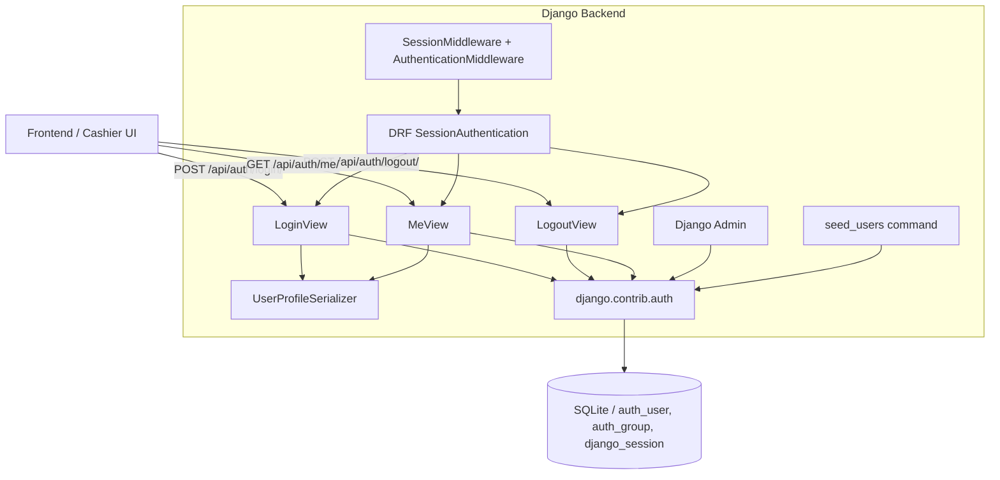

# Design Document: cashier-auth

## Overview

This feature implements session-based authentication and role-based access control for the retail checkout automation system. It uses Django's built-in `auth` framework (the `User` model, `Group` model, and session machinery) together with Django REST Framework's `SessionAuthentication`. No custom user model is needed — the built-in `User` is extended only through Django Admin configuration and group assignments.

The three API endpoints (`/api/auth/login/`, `/api/auth/logout/`, `/api/auth/me/`) live in the existing `apps.accounts` app, which is currently empty. A `seed_users` management command bootstraps the two groups and a default cashier user for development environments.

Account provisioning is exclusively through Django Admin — there is no public registration endpoint.

---

## Architecture



**Request flow for a protected endpoint:**

1. Django's `SessionMiddleware` reads the session cookie and populates `request.session`.
2. `AuthenticationMiddleware` attaches the user to `request.user`.
3. DRF's `SessionAuthentication` authenticates the request using `request.user`.
4. The view's permission class (`IsAuthenticated`) allows or rejects the request.

---

## Components and Interfaces

### 1. `UserProfileSerializer` (`apps/accounts/serializers.py`)

Serializes the built-in `User` model into the profile JSON shape required by all three endpoints.

```python
fields = ["id", "username", "first_name", "last_name", "email",
          "groups", "is_staff", "is_superuser"]
```

`groups` is a `SerializerMethodField` that returns a list of group name strings (not PKs).

### 2. `LoginView` (`apps/accounts/views.py`)

- Method: `POST`
- Permission: `AllowAny` (overrides the default `IsAuthenticated`)
- Accepts `{"username": "...", "password": "..."}` in the request body.
- Calls `django.contrib.auth.authenticate()` then `django.contrib.auth.login()`.
- Returns `UserProfileSerializer` data on success (HTTP 200).
- Returns HTTP 400 with a descriptive error on invalid credentials, missing fields, or inactive account.

### 3. `LogoutView` (`apps/accounts/views.py`)

- Method: `POST`
- Permission: `IsAuthenticated` (default)
- Calls `django.contrib.auth.logout()`.
- Returns `{"detail": "Successfully logged out."}` (HTTP 200).
- Returns HTTP 401 if no valid session is present (enforced by DRF).

### 4. `MeView` (`apps/accounts/views.py`)

- Method: `GET`
- Permission: `IsAuthenticated` (default)
- Returns `UserProfileSerializer(request.user)` data (HTTP 200).
- Returns HTTP 401 if no valid session is present.

### 5. `apps/accounts/urls.py`

```python
urlpatterns = [
    path("login/",  LoginView.as_view(),  name="auth-login"),
    path("logout/", LogoutView.as_view(), name="auth-logout"),
    path("me/",     MeView.as_view(),     name="auth-me"),
]
```

### 6. `CustomUserAdmin` (`apps/accounts/admin.py`)

Extends Django's built-in `UserAdmin` to ensure the required fields (`username`, `first_name`, `last_name`, `email`, `is_staff`, `is_active`, `groups`) are visible and editable in the Django Admin interface.

### 7. `seed_users` management command (`apps/accounts/management/commands/seed_users.py`)

Idempotent command that:
1. Creates the `Admin` group (skip if exists).
2. Creates the `Cashier` group (skip if exists).
3. Creates the `adamreta` cashier user (skip if exists).
4. Prints a created/skipped message for each resource.

### 8. DRF Settings (`config/settings.py`)

The `REST_FRAMEWORK` dict must be updated to:

```python
REST_FRAMEWORK = {
    "DEFAULT_AUTHENTICATION_CLASSES": [
        "rest_framework.authentication.SessionAuthentication",
    ],
    "DEFAULT_PERMISSION_CLASSES": [
        "rest_framework.permissions.IsAuthenticated",
    ],
    "DEFAULT_RENDERER_CLASSES": [
        "rest_framework.renderers.JSONRenderer",
        "rest_framework.renderers.BrowsableAPIRenderer",
    ],
}
```

> **Note:** The current settings use `IsAuthenticatedOrReadOnly`. This must be changed to `IsAuthenticated` to satisfy Requirement 3.2 and ensure unauthenticated requests to protected endpoints return HTTP 401.

### 9. URL Registration (`config/urls.py`)

Replace the existing `rest_framework.urls` include with the accounts app:

```python
path("api/auth/", include("apps.accounts.urls")),
```

---

## Data Models

No new database models are introduced. The feature relies entirely on Django's built-in models:

| Model | Source | Purpose |
|---|---|---|
| `User` | `django.contrib.auth.models` | Stores user credentials and profile |
| `Group` | `django.contrib.auth.models` | Represents `Admin` and `Cashier` roles |
| `Session` | `django.contrib.sessions.models` | Server-side session storage |

**Group → User relationship:** Many-to-many via `User.groups`. A user may belong to one or both groups; the application logic treats group membership as the role indicator.

**Profile JSON shape** (returned by login and me endpoints):

```json
{
  "id": 1,
  "username": "adamreta",
  "first_name": "Adam",
  "last_name": "Reta",
  "email": "",
  "groups": ["Cashier"],
  "is_staff": false,
  "is_superuser": false
}
```

---

## Correctness Properties

*A property is a characteristic or behavior that should hold true across all valid executions of a system — essentially, a formal statement about what the system should do. Properties serve as the bridge between human-readable specifications and machine-verifiable correctness guarantees.*

**PBT applicability assessment:** This feature contains several universal properties suitable for property-based testing: login success/failure behavior across arbitrary users, session round-trip (login → logout → unauthenticated), profile response shape for any user, and seed command idempotency. These are pure-logic behaviors that vary meaningfully with input and are cost-effective to run 100+ times (no external services, all in-memory SQLite).

**Property reflection:** After reviewing all testable criteria:
- 4.1 and 4.2 can be combined: login success + response shape is one property.
- 6.1 and 6.2 can be combined: me success + response shape is one property.
- 8.1, 8.2, 8.4, and 8.5 can be combined into one idempotency property for the seed command.
- 4.3 (wrong password → 400) stands alone as a distinct property.
- 5.1 (logout destroys session) stands alone as a round-trip property.
- 8.7 (stdout messages) stands alone.

---

### Property 1: Login with valid credentials returns full profile

*For any* active user with a known password, a POST to `/api/auth/login/` with correct credentials SHALL return HTTP 200 and a JSON body containing all required fields: `id`, `username`, `first_name`, `last_name`, `email`, `groups` (list of strings), `is_staff`, and `is_superuser`.

**Validates: Requirements 4.1, 4.2**

---

### Property 2: Login with wrong password returns HTTP 400

*For any* existing user, a POST to `/api/auth/login/` with an incorrect password SHALL return HTTP 400 and the response body SHALL NOT contain a session cookie.

**Validates: Requirements 4.3**

---

### Property 3: Logout destroys session (round-trip)

*For any* authenticated user, after a successful POST to `/api/auth/logout/` (HTTP 200), a subsequent GET to `/api/auth/me/` SHALL return HTTP 401, confirming the session has been destroyed.

**Validates: Requirements 5.1, 5.2 (indirectly)**

---

### Property 4: Me endpoint returns correct profile for any authenticated user

*For any* active user who has logged in, a GET to `/api/auth/me/` SHALL return HTTP 200 and a JSON body where `username`, `groups`, `is_staff`, and `is_superuser` match the user's actual database record.

**Validates: Requirements 6.1, 6.2**

---

### Property 5: seed_users is idempotent

*For any* number of executions of `seed_users` (≥ 1), the resulting state SHALL contain exactly one `Admin` group, exactly one `Cashier` group, and exactly one `adamreta` user — regardless of whether those resources existed before the command ran.

**Validates: Requirements 8.1, 8.2, 8.4, 8.5**

---

### Property 6: seed_users stdout reports created or skipped for every resource

*For any* execution of `seed_users`, the captured stdout SHALL contain a message for each of the three managed resources (Admin group, Cashier group, adamreta user) indicating either creation or that the resource already existed.

**Validates: Requirements 8.7**

---

## Error Handling

| Scenario | HTTP Status | Response Body |
|---|---|---|
| Login — missing `username` or `password` | 400 | `{"error": "username and password are required"}` |
| Login — wrong credentials | 400 | `{"error": "Invalid credentials"}` |
| Login — inactive account | 400 | `{"error": "This account is inactive"}` |
| Logout — no session | 401 | DRF default: `{"detail": "Authentication credentials were not provided."}` |
| Me — no session | 401 | DRF default: `{"detail": "Authentication credentials were not provided."}` |
| Any protected endpoint — no session | 401 | DRF default |

**CSRF:** DRF's `SessionAuthentication` enforces CSRF for session-authenticated requests. The frontend must include the `X-CSRFToken` header (read from the `csrftoken` cookie) on all state-changing requests (POST). The login endpoint uses `AllowAny` but is still subject to CSRF enforcement by DRF when session auth is active — the frontend must handle this. For development, `CORS_ALLOW_CREDENTIALS = True` and the CORS origin must be configured.

---

## Testing Strategy

**Framework:** Django's built-in `TestCase` + `APIClient` from DRF. Property-based tests use [Hypothesis](https://hypothesis.readthedocs.io/) with the `django` extra (`hypothesis[django]`).

**Dual approach:**
- **Example-based tests** cover specific scenarios, edge cases, and the 9 required test cases from Requirement 9.
- **Property-based tests** cover the 6 correctness properties above, each running a minimum of 100 iterations.

### Example-based tests (required by Requirement 9)

Located in `apps/accounts/tests.py`:

1. `test_seed_creates_admin_group` — run `seed_users`, assert `Group.objects.filter(name="Admin").exists()`
2. `test_seed_creates_cashier_group` — run `seed_users`, assert `Group.objects.filter(name="Cashier").exists()`
3. `test_seed_creates_adamreta_user` — run `seed_users`, assert user attributes and group membership
4. `test_login_success` — POST `{"username": "adamreta", "password": "123"}`, assert HTTP 200
5. `test_login_wrong_password` — POST with wrong password, assert HTTP 400
6. `test_me_unauthenticated` — GET `/api/auth/me/` without session, assert HTTP 401
7. `test_me_authenticated` — login then GET `/api/auth/me/`, assert HTTP 200 and correct profile
8. `test_logout_destroys_session` — login, logout, GET `/api/auth/me/`, assert HTTP 401
9. `test_no_register_endpoint` — GET/POST `/api/auth/register/`, assert HTTP 404 or 405

### Property-based tests

Located in `apps/accounts/tests.py` (or a separate `tests_properties.py`):

Each property test is tagged with a comment in the format:
`# Feature: cashier-auth, Property N: <property_text>`

- **Property 1 test:** Use `hypothesis.strategies` to generate arbitrary `username`, `first_name`, `last_name`, `email`, `password` strings. Create the user, POST to login, assert 200 and all required JSON fields present. Min 100 iterations.
- **Property 2 test:** Generate arbitrary users and arbitrary wrong passwords (guaranteed ≠ correct password). Assert 400. Min 100 iterations.
- **Property 3 test:** Generate arbitrary users. Login, logout, GET `/me/`, assert 401. Min 100 iterations.
- **Property 4 test:** Generate arbitrary users with arbitrary group assignments. Login, GET `/me/`, assert response fields match DB record. Min 100 iterations.
- **Property 5 test:** Run `seed_users` 1–5 times (generated count). Assert exactly 1 Admin group, 1 Cashier group, 1 adamreta user. Min 100 iterations.
- **Property 6 test:** Run `seed_users` with varying pre-existing state (0 or 1 of each resource already present). Assert stdout contains a message for each resource. Min 100 iterations.

### Running tests

```bash
cd backend
python manage.py test apps.accounts
```
